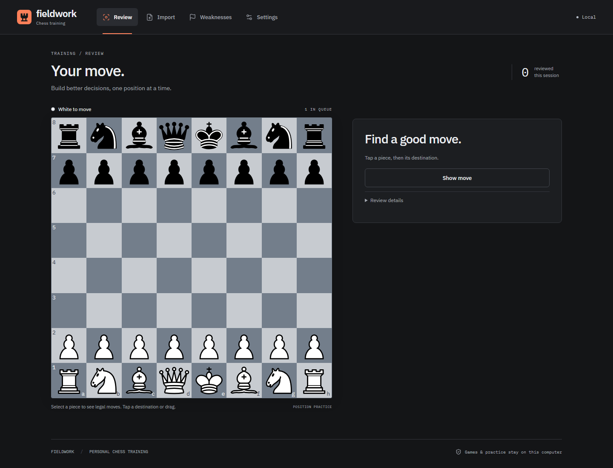

# Fieldwork — local chess practice

A private chess trainer built around decisions in your own games. Import Chess.com history by username or upload PGNs, analyze learner moves with native Stockfish, practice meaningful mistakes, and retain them with FSRS. Local rules classify supported tactical patterns from saved engine evidence. Review is the primary product; lessons have been removed from the interface, with historical data preserved.

Python-chess owns rules; Stockfish owns evaluation; configurable Python policy owns grading. The pinned Lichess tagger recognizes tactical motifs; versioned Fieldwork evidence checks decide which findings support a mistake label. There is no LLM integration or API-key requirement. The application can run locally or be self-hosted for friends with private accounts in one SQLite database.

Install with [Docker](docs/DOCKER.md) or the [Unraid template](docs/UNRAID.md).
One container includes Stockfish and its database; no source checkout is needed.

```sh
docker run -d --name fieldwork --restart unless-stopped --init -p 18000:8000 -v fieldwork-data:/data ghcr.io/reldnahc/chesstrainer:latest
```

Open `http://localhost:18000` (or your server's LAN IP). For private accounts behind
HTTPS, follow [shared hosting](docs/DOCKER.md#shared-https-hosting).
See [account administration](docs/ACCOUNTS.md) for account recovery.

Leave `PUBLIC_ORIGIN` blank for local single-user operation without login. Everyone
who can reach that instance shares its local games and progress. For shared hosting
with separate accounts, set `ACCOUNTS_ENABLED=true` (already the Docker image default)
and `PUBLIC_ORIGIN=https://your-chess-hostname`. Restart after changing modes.

## Implemented

See [Feature status](docs/FEATURE_STATUS.md) for the comparison with the original specification and the limits of each feature.

- Multi-game PGN import, explicit learner matching, duplicate detection and original provenance. Only newly added games enter new analysis jobs.
- Chess.com username import with time-class filters, lookback or exact dates, and a new-game limit. Downloads resume from archive checkpoints.
- Persistent jobs, progress, cancellation/retry and startup recovery. Bounded Stockfish and local classification pools reuse compatible completed work.
- Two-pass native analysis, MultiPV, separate mate/centipawn scores and a durable cache. Practical grading accepts verified sound alternatives.
- Local classification v4 reuses the pinned Lichess tactical tagger and separates material/mate outcomes from specific patterns, with auditable witnesses and explicit abstentions. Settings can deepen a capped batch of unclear positions without changing original exercise answers.
- Evidence-linked weakness groups and focused practice of up to 12 distinct positions. Focused attempts are saved separately from FSRS.
- Cold review with drag/drop, tap-to-move, legal-move dots/capture rings and promotion selection. Failures preview a verified counter; Show me why opens deeper playback. Reveal move plays the saved answer.
- Full-game review in **Games**: saved analysis for both players, move-quality labels, an evaluation timeline, an illustrated tactical coach, and playable branching variations. Pause/resume preserves completed analysis; game review never changes scheduled practice. See [Game review](docs/GAME_REVIEW.md) for scoring and evidence limits.
- FSRS scheduling, one failed recall per session, continued retries and permanent retirement above a configurable interval threshold (100 days by default).
- Same-origin LAN operation, optional shared access token, or self-service accounts with private data and persistent device sessions. CLI backup/restore covers the single database.
- Remembered Chess.com usernames and automatic recent-game fetching without engine analysis. Start full review or training analysis explicitly from a saved game.

Navigation is **Review, Games, Weaknesses, Import, Settings**. The initial cold review board hides source, concepts, scores and answers; feedback and playback become available after an attempt or reveal. Games provides open analysis and coaching for the complete game. Lessons, Repertoire and manual-position entry forms are removed. Historical records and compatibility APIs remain; see [Product](docs/PRODUCT.md#removed-and-archived).



[Mobile review](docs/screenshots/review-mobile.png) / [Mobile settings](docs/screenshots/settings-mobile.png) / [Desktop username import](docs/screenshots/import-desktop.png) / [Mobile username import](docs/screenshots/import-mobile.png)

Screenshots use isolated test positions and provider fixtures, not private game data.

## Prerequisites

Python 3.12+, Node.js 22.12+ (Node 24 tested), and a native [Stockfish executable](https://stockfishchess.org/download/) compatible with your CPU. Extract the executable; do not configure its ZIP/directory. On Linux use your distribution's package; macOS users can also use Homebrew. No model service or API key is required.

## Install and run

From the repository root:

```sh
python -m venv .venv
# Linux/macOS:
source .venv/bin/activate
# Windows PowerShell instead:
# .venv\Scripts\Activate.ps1
python -m pip install -r requirements.lock
python -m pip install --no-deps -e .
```

If PowerShell script execution is disabled, activation is unnecessary: use `.venv\Scripts\python.exe` and `npm.cmd` instead.

Copy `.env.example` to `.env` and set the native engine path:

```dotenv
STOCKFISH_PATH=C:/tools/stockfish/stockfish-windows-x86-64-avx2.exe
# Linux/macOS example: /usr/local/bin/stockfish
CLASSIFICATION_WORKERS=2
```

Classification runs locally after analysis; the vendored Lichess code makes no network requests. Restart after editing configuration. Settings displays effective values without exposing the optional LAN token.

```sh
cd frontend
npm ci
npm run build
cd ..
python -m trainer
```

The build also prepares **Settings > Download source code**, including the pinned tagger and licenses. Build from a Git checkout (stage newly added public source files first) or an exported source snapshot. The helper uses the checkout's .venv Python; set SOURCE_PYTHON to use another executable. Games, databases, secrets and untracked files are excluded.

Open **http://127.0.0.1:8000**. Startup applies Alembic migrations, seeds skills and checks Stockfish. Missing Stockfish produces an actionable status. Saved answers and saved-evidence classification remain usable; new analysis and unlisted engine answers require the executable. Data defaults to `data/trainer.sqlite3`.

Explicit migration commands are `alembic upgrade head` and `alembic check`. Run from a source checkout: migrations and frontend assets live beside the Python package; standalone wheel deployment is not supported yet.

## First session

1. Open Import and enter your Chess.com username. Defaults fetch up to 100 **new** rapid games from the current and preceding two calendar months. Change time class, range or limit as needed, then click **Fetch & analyze games**. No login or API key is needed. Alternatively choose **PGN file**, identify your username(s), and explicitly assign a side only when it is yours in every game.
2. Watch progress; invalid or ambiguous games are reported separately. Completed work survives interruptions. Retry an older cancelled job separately; a new import only queues new games.
3. Open Review. Meaningful errors become practice; small engine preferences usually do not. Try a move, inspect the saved counter/playback when useful, and continue to the next position.
4. Open Weaknesses to inspect supported recurring patterns and their evidence. Choose a skill for focused practice; those attempts do not change your scheduled recalls. Unclassified mistakes remain available in Review.
5. Use **Settings > Classify saved games** to classify existing analyses locally, or **Deepen unclear positions** for optional bounded Stockfish evidence. No model setup is needed.

## Local network

Set `SERVER_HOST` in `.env` to the host's home-network IPv4 address (find it using `ipconfig`) and restart. Connect the phone to the same trusted network; the host may use Ethernet. Open `http://HOST-LAN-IP:8000` on both desktop and phone. Binding a specific address limits the listening interface; `0.0.0.0` instead listens on every IPv4 interface if that is explicitly desired. Production frontend and API share one origin.

On Windows, run this once from an administrator PowerShell in the repository root, substituting your host address:

```powershell
powershell.exe -NoProfile -ExecutionPolicy Bypass -File scripts/allow-lan.ps1 -LocalAddress 192.168.1.12
```

The firewall helper allows TCP 8000 to that address from the local subnet on **Private** networks only. Pass `-Port` if you changed `SERVER_PORT`. Remove the rule with `Remove-NetFirewallRule -Name Fieldwork-LAN-TCP-8000` as administrator. Keep the host awake and backend running. Guest Wi-Fi isolation can prevent phone access. If the host IP changes, update `.env` and rerun the helper; a router DHCP reservation can keep the address stable.

Optionally set LAN_ACCESS_TOKEN and enter it in the browser. The token is kept in session storage. This is a shared private-network gate, not full authentication or encryption. **Do not expose the application directly to the public internet without securing it.** Run one Uvicorn process, never multiple `--workers`.

## Development and tests

The Vite proxy targets **127.0.0.1:8000**. Stop an existing backend using the same database before starting a development instance. If .env is configured for a LAN address or another port, override those values in the development backend terminal.

PowerShell, with the virtual environment activated:

```powershell
$env:SERVER_HOST = '127.0.0.1'
$env:SERVER_PORT = '8000'
python -m trainer
```

Linux/macOS equivalent: `SERVER_HOST=127.0.0.1 SERVER_PORT=8000 python -m trainer`. In a second terminal, run `npm run dev` inside frontend and open http://127.0.0.1:5173. Production/LAN use serves the built frontend directly from the backend instead.

```sh
python -m pytest -q
ruff check backend scripts migrations
ruff format --check backend scripts migrations
cd frontend
npm run build
npx playwright install chromium
npx playwright test
```

Build before running tests that use frontend/dist; do not rebuild it during backend or browser suites. Set STOCKFISH_PATH for native integration tests; missing Stockfish produces explicit skips. Normal tests make no model or live Chess.com requests. Playwright uses an isolated database and both desktop and phone-emulated Chromium projects.

[TESTING.md](docs/TESTING.md) includes isolated migration/schema-drift checks and platform-specific commands. [VERIFICATION.md](docs/VERIFICATION.md) records completed results and limits.

Developer-only [Lichess benchmark tooling](docs/LICHESS_BENCHMARK.md) streams a local puzzle dataset to measure positive-theme agreement with the shared tactical detector. It does not add puzzle training to the app or infer precision from missing tags. The [initial external baseline](docs/LICHESS_BENCHMARK_RESULTS.md) preserves per-theme results and limitations. [Lichess reuse](docs/LICHESS_REUSE.md) records the pinned implementation and frozen before/after comparison; agreement with related upstream labels is not independent precision.

## Backup and privacy

```sh
python scripts/backup.py export data/backups/practice.zip
python scripts/backup.py restore data/backups/practice.zip --destination data/restored.sqlite3
```

Export uses SQLite's online backup API, including committed WAL state. Restore validates integrity/foreign keys and only writes to a **new** path. Stop the server, set DATABASE_PATH to the restored file and restart. Safe settings are included for reference; reapply them manually. API keys and LAN token values are excluded. Backups themselves contain private games.

Games, analysis, classification, explanations, exercises and review history stay on the host. There is no OpenAI SDK, model connection or outbound pedagogy payload. Legacy model audit records are retained locally for historical reference/export. No telemetry, remote fonts or external board assets are used. IBM Plex fonts are bundled locally; their license notices are in [docs/licenses](docs/licenses).

Username import contacts Chess.com's public API from the backend, sending the requested username/archive paths and configured User-Agent. It downloads completed games and never sends moves, credentials, your database or existing local games to Chess.com. Archive data may be delayed by provider caching. Repeat imports deduplicate against both previous downloads and PGN uploads. See [Chess.com import details](docs/CHESSCOM_IMPORT.md).

## Documentation

- [Product](docs/PRODUCT.md), [feature status](docs/FEATURE_STATUS.md) and [development plan](docs/DEVELOPMENT_PLAN.md)
- [Architecture](docs/ARCHITECTURE.md), [analysis pipeline](docs/ANALYSIS_PIPELINE.md) and [data model](docs/DATA_MODEL.md)
- [Local classification](docs/LOCAL_CLASSIFICATION.md), [assistant assessment](docs/CLASSIFICATION_ASSESSMENT.md), [external puzzle benchmark](docs/LICHESS_BENCHMARK.md) and [weakness priorities / archived curriculum](docs/CURRICULUM_ENGINE.md)
- [Spaced repetition](docs/SRS.md), [configuration](docs/CONFIGURATION.md) and [Chess.com import](docs/CHESSCOM_IMPORT.md)
- [Testing procedure](docs/TESTING.md), [latest verification](docs/VERIFICATION.md), [decisions](docs/DECISIONS.md) and [implementation history](docs/IMPLEMENTATION_HISTORY.md)

## Forking and licensing

Keep authority boundaries explicit, add deterministic fixtures for chess changes, update living documents and use Alembic revisions for schema changes. Never commit .env, private databases/PGNs, binaries or dependency folders. requirements.lock and frontend/package-lock.json pin tested dependencies.

Original Fieldwork source remains GPL-3.0-or-later; see [LICENSE](LICENSE). The vendored Lichess tagger is AGPL-3.0. The combined application includes a local source download and carries the applicable AGPL obligations; see [NOTICE.md](NOTICE.md) and [upstream provenance](backend/trainer/_vendor/lichess_puzzler/README.md). Python-chess is GPL-licensed; Stockfish is GPLv3 and installed separately, not bundled in source. Preserve relevant license notices and source obligations when redistributing GPL components. Other libraries retain their own licenses.

For blinded human/assistant annotation, frozen comparisons and reviewer provenance, see [Local classification evaluation](docs/LOCAL_CLASSIFICATION.md#configuration-and-evaluation). Coverage is measured separately from accuracy.
